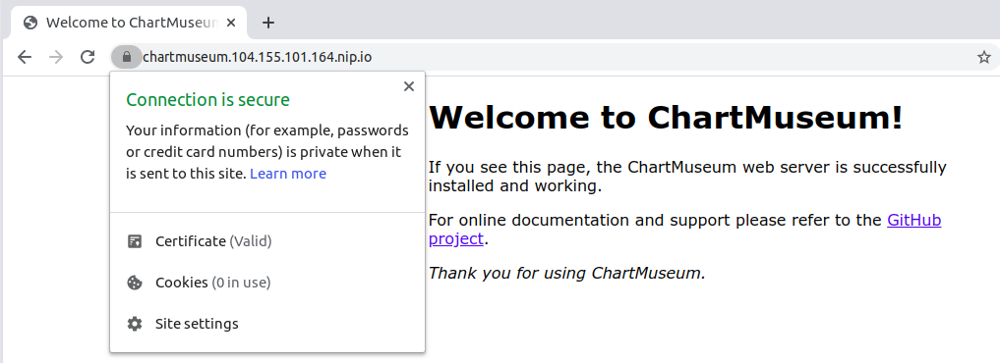
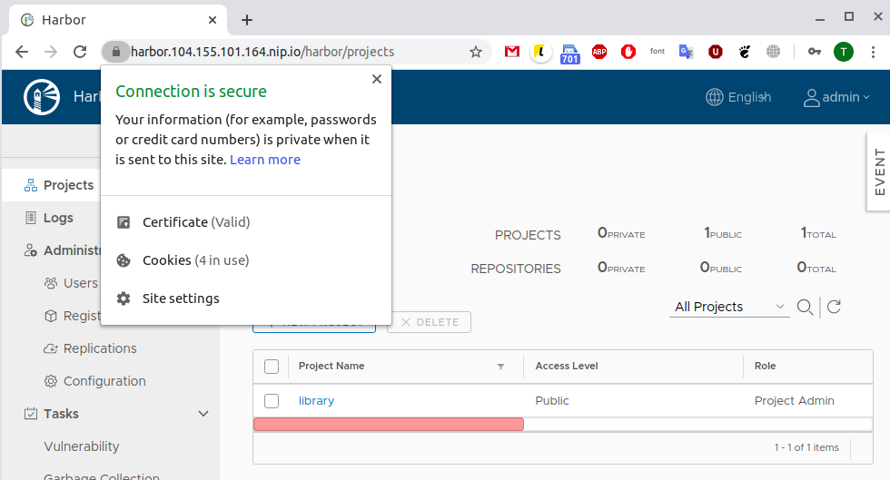
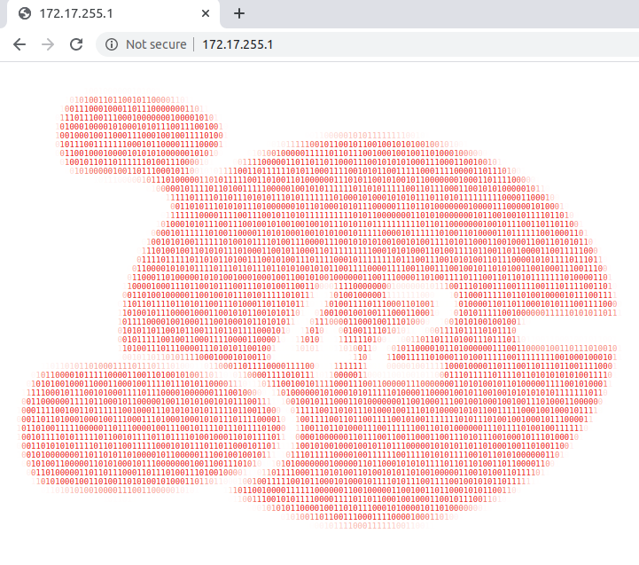
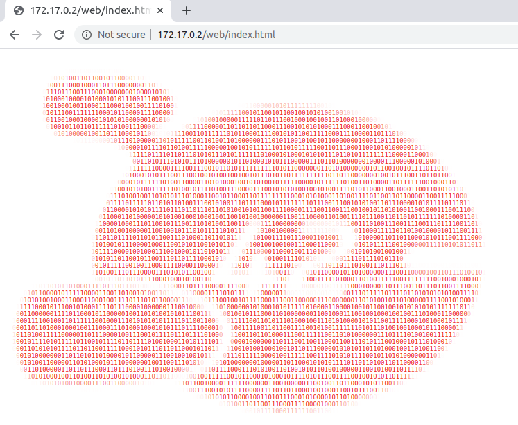
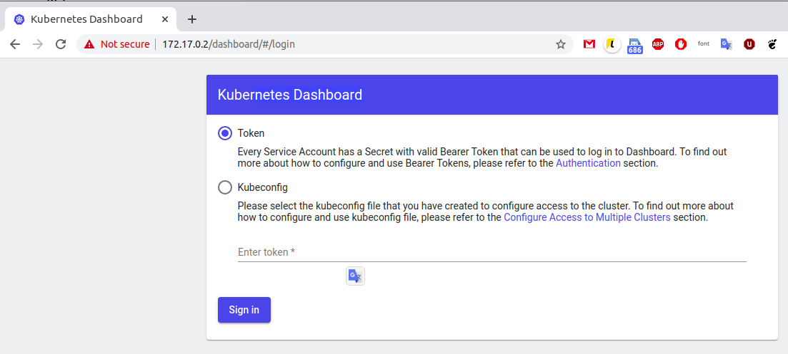

# Otus Kubernetes course


## HW-6 Templates


### How to use

Clone repo. Change dir `cd kubernetes-templates`. Run commands bellow.

### GCP Kubernetes

https://cloud.google.com/kubernetes-engine/

https://cloud.google.com/compute/docs/instances/interacting-with-serial-console

Create new cluster on gCP.

#### Install gcloud

https://cloud.google.com/sdk/docs/quickstart-linux

Connect by using command from button `connect` on cluster page.
```
└─$> gcloud container clusters get-credentials cluster-1 --zone europe-west1-b --project otus-kuber-*****
Fetching cluster endpoint and auth data.
kubeconfig entry generated for cluster-1.
```

#### Check

```
└─$>  kubectl config current-context
gke_otus-kuber-*****_europe-west1-b_cluster-1

└─$> gcloud beta container clusters get-credentials cluster-1 
Fetching cluster endpoint and auth data.
kubeconfig entry generated for cluster-1.
```

### Helm

#### Install

https://github.com/helm/helm#install

#### Add google repo

```
└─$> helm repo add stable https://kubernetes-charts.storage.googleapis.com
"stable" has been added to your repositories

└─$> helm repo list
NAME    	URL                                             
stable  	https://kubernetes-charts.storage.googleapis.com

```

### Helm charts

https://github.com/helm/charts/tree/master/stable/nginx-ingress

https://github.com/jetstack/cert-manager/tree/master/deploy/charts/cert-manager

https://github.com/helm/charts/tree/master/stable/chartmuseum

https://github.com/goharbor/harbor-helm

#### Ingress

* Create namespaces and releases

```
└─$> kubectl create ns nginx-ingress
namespace/nginx-ingress created

└─$> helm upgrade --install nginx-ingress stable/nginx-ingress --wait \
 --namespace=nginx-ingress \
 --version=1.11.1
Release "nginx-ingress" does not exist. Installing it now.
NAME: nginx-ingress
LAST DEPLOYED: Fri May 29 15:07:12 2020
NAMESPACE: nginx-ingress
STATUS: deployed
REVISION: 1
TEST SUITE: None
NOTES:
The nginx-ingress controller has been installed.
It may take a few minutes for the LoadBalancer IP to be available.
You can watch the status by running 'kubectl --namespace nginx-ingress get services -o wide -w nginx-ingress-controller'
...
```


#### Cert-manager

Add repo
```└─$> helm repo add jetstack https://charts.jetstack.io
"jetstack" has been added to your repositories
```

Create CRD https://github.com/jetstack/cert-manager/tree/master/deploy/charts/cert-manager
```
└─$> kubectl apply -f https://raw.githubusercontent.com/jetstack/cert-manager/release-0.9/deploy/manifests/00-crds.yaml
customresourcedefinition.apiextensions.k8s.io/certificates.certmanager.k8s.io created
customresourcedefinition.apiextensions.k8s.io/certificaterequests.certmanager.k8s.io created
customresourcedefinition.apiextensions.k8s.io/challenges.certmanager.k8s.io created
customresourcedefinition.apiextensions.k8s.io/clusterissuers.certmanager.k8s.io created
customresourcedefinition.apiextensions.k8s.io/issuers.certmanager.k8s.io created
customresourcedefinition.apiextensions.k8s.io/orders.certmanager.k8s.io created
```

Setup
```
└─$> kubectl create ns cert-manager
namespace/cert-manager created

└─$> kubectl label namespace cert-manager certmanager.k8s.io/disable-validation="true"
namespace/cert-manager labeled
```

Install
```
└─$> helm upgrade --install cert-manager jetstack/cert-manager --wait \
 --namespace=cert-manager \
 --version=0.9.0
Release "cert-manager" does not exist. Installing it now.
NAME: cert-manager
LAST DEPLOYED: Fri May 29 15:23:01 2020
NAMESPACE: cert-manager
STATUS: deployed
REVISION: 1
TEST SUITE: None
NOTES:
cert-manager has been deployed successfully!
...
```

##### Issuer

For correct work need to create issuer 

https://cert-manager.io/docs/installation/kubernetes/#configuring-your-first-issuer

https://docs.cert-manager.io/en/release-0.11/tasks/issuers/index.html

```
└─$> kubectl apply -f ./cert-manager/issuer-letsencrypt.yaml 
clusterissuer.certmanager.k8s.io/issuer-letsencrypt created

└─$> kubectl describe ClusterIssuer 
Name:         issuer-letsencrypt
Namespace:    
Labels:       <none>
Annotations:  API Version:  certmanager.k8s.io/v1alpha1
Kind:         ClusterIssuer
Metadata:
  Creation Timestamp:  2020-05-29T12:44:00Z
  Generation:          2
  Resource Version:    15429
  Self Link:           /apis/certmanager.k8s.io/v1alpha1/clusterissuers/issuer-letsencrypt
  UID:                 11ef9bd0-a1aa-11ea-bde0-42010a840235
...
```

#### Chartmuseum

https://github.com/helm/charts/tree/master/stable/chartmuseum

https://github.com/helm/charts/blob/master/stable/chartmuseum/values.yaml

##### Install
```
└─$> kubectl create ns chartmuseum
namespace/chartmuseum created

└─$> helm upgrade --install chartmuseum stable/chartmuseum --wait --namespace=chartmuseum --version=2.3.2 -f chartmuseum/values.yaml
Release "chartmuseum" does not exist. Installing it now.
NAME: chartmuseum
LAST DEPLOYED: Sat May 30 09:36:28 2020
NAMESPACE: chartmuseum
STATUS: deployed
REVISION: 1
TEST SUITE: None
NOTES:
** Please be patient while the chart is being deployed **

Get the ChartMuseum URL by running:

  export POD_NAME=$(kubectl get pods --namespace chartmuseum -l "app=chartmuseum" -l "release=chartmuseum" -o jsonpath="{.items[0].metadata.name}")
  echo http://127.0.0.1:8080/
  kubectl port-forward $POD_NAME 8080:8080 --namespace chartmuseum
```

##### Check
```
└─$> helm ls -n chartmuseum
NAME       	NAMESPACE  	REVISION	UPDATED                                	STATUS  	CHART            	APP VERSION
chartmuseum	chartmuseum	1       	2020-05-30 16:37:48.617500332 +0300 MSK	deployed	chartmuseum-2.3.2	0.8.2  

└─$> curl https://$(kubectl get ingress chartmuseum-chartmuseum -n chartmuseum -o jsonpath={.spec.rules[0].host})
...
<title>Welcome to ChartMuseum!</title>
...
```

##### How to use Chartmuseum (*)

```
└─$> helm repo add chartmuseum https://chartmuseum.104.155.101.164.nip.io/
"chartmuseum" has been added to your repositories

└─$> helm repo list
NAME       	URL                                             
stable     	https://kubernetes-charts.storage.googleapis.com
jetstack   	https://charts.jetstack.io                      
chartmuseum	https://chartmuseum.104.155.101.164.nip.io/     


└─$> helm repo update
Hang tight while we grab the latest from your chart repositories...
...Successfully got an update from the "chartmuseum" chart repository
...Successfully got an update from the "stable" chart repository
...Successfully got an update from the "jetstack" chart repository
Update Complete. ⎈ Happy Helming!⎈ 

└─$> helm pull stable/chartmuseum --version=2.3.2

└─$> curl -L --data-binary "@chartmuseum-2.3.2.tgz" https://chartmuseum.104.155.101.164.nip.io/api/charts
{"saved":true}
```



### Harbor

https://github.com/goharbor/harbor-helm

#### Install

  ```
└─$> helm repo add harbor https://helm.goharbor.io
"harbor" has been added to your repositories

└─$> kubectl create ns harbor
namespace/harbor created

└─$> helm upgrade --install harbor harbor/harbor --wait --namespace=harbor --version=1.1.2 -f harbor/values.yaml
Release "harbor" does not exist. Installing it now.
NAME: harbor
LAST DEPLOYED: Sun May 31 10:11:44 2020
NAMESPACE: harbor
STATUS: deployed
REVISION: 1
TEST SUITE: None
NOTES:
Please wait for several minutes for Harbor deployment to complete.
Then you should be able to visit the Harbor portal at https://harbor.104.155.101.164.nip.io. 
For more details, please visit https://github.com/goharbor/harbor.

└─$> kubectl get secrets -n harbor -l owner=helm
NAME                           TYPE                 DATA   AGE
sh.helm.release.v1.harbor.v1   helm.sh/release.v1   1      15m
```

#### Status

```
└─$> helm ls -n harbor
NAME    NAMESPACE       REVISION        UPDATED                                 STATUS          CHART           APP VERSION
harbor  harbor          1               2020-05-31 10:11:44.202733384 +0300 MSK deployed        harbor-1.1.2    1.8.2     

└─$> curl https://$(kubectl get ingress harbor-harbor-ingress -n harbor -o jsonpath={.spec.rules[0].host})
...
    <title>Harbor</title>
...
```



### Helm chart

We will use https://github.com/GoogleCloudPlatform/microservices-demo

#### Install 

Init structure
```
└─$> helm create hipster-shop
Creating hipster-shop
```

Install
```
└─$> kubectl create ns hipster-shop
namespace/hipster-shop created

└─$> helm upgrade --install hipster-shop ./hipster-shop --namespace hipster-shop
Release "hipster-shop" does not exist. Installing it now.
NAME: hipster-shop
LAST DEPLOYED: Sun May 31 10:46:23 2020
NAMESPACE: hipster-shop
STATUS: deployed
REVISION: 1
TEST SUITE: None
```

##### Check

1. Using firewall rile for PortNode
```
└─$> gcloud compute firewall-rules create test-node-port --allow tcp:$(kubectl get svc/frontend -n hipster-shop -o jsonpath={.spec.ports[0].nodePort})
Creating firewall...⠹Created [https://www.googleapis.com/compute/v1/projects/otus-kuber-278614/global/firewalls/test-node-port].                                                                    
Creating firewall...done.                                                                                                                                                                           
NAME            NETWORK  DIRECTION  PRIORITY  ALLOW      DENY  DISABLED
test-node-port  default  INGRESS    1000      tcp:32145        False

└─$> curl -v http://$(kubectl get nodes -o jsonpath='{.items[0].status.addresses[?(@.type=="ExternalIP")].address}'):$(kubectl get svc/frontend -n hipster-shop -o jsonpath={.spec.ports[0].nodePort})
*   Trying 34.78.55.255:32145...
* TCP_NODELAY set
* Connected to 34.78.55.255 (34.78.55.255) port 32145 (#0)
> GET / HTTP/1.1
> Host: 34.78.55.255:32145
> User-Agent: curl/7.68.0
> Accept: */*
...

```

2. Using ingress

Example
```
apiVersion: networking.k8s.io/v1beta1
kind: Ingress
metadata:
  name: hipstershop-frontend
spec:
  rules:
    - host: shop.YOUR_IP.nip.io
      http:
        paths:
          - path: /
            backend:
              serviceName: frontend
              servicePort: 80

└─$> curl http://$(kubectl get ingress frontend -n hipster-shop -o jsonpath={.spec.rules[0].host})              
```

#### Helm chart for frontend app

Config in dir `frontend`.

Update helm pkg dependencies
```
└─$> helm dep update ./hipster-shop
Hang tight while we grab the latest from your chart repositories...
...Successfully got an update from the "harbor" chart repository
...Successfully got an update from the "jetstack" chart repository
...Successfully got an update from the "chartmuseum" chart repository
...Successfully got an update from the "stable" chart repository
Update Complete. ⎈Happy Helming!⎈
Saving 1 charts
Deleting outdated charts
```

Test
```
└─$> helm upgrade --install frontend ./frontend/ --namespace hipster-shop
Release "frontend" has been upgraded. Happy Helming!
NAME: frontend
LAST DEPLOYED: Sun May 31 20:53:16 2020
NAMESPACE: hipster-shop
STATUS: deployed
REVISION: 7
TEST SUITE: None
```

### Kubecfg

Install `kubecfg` by using manual https://github.com/bitnami/kubecfg

Jsonnet guestbook kubecfg:

https://github.com/bitnami/kubecfg/blob/master/examples/guestbook.jsonnet

https://github.com/bitnami-labs/kube-libsonnet/raw/52ba963ca44f7a4960aeae9ee0fbee44726e481f/kube.libsonnet

#### Check

```
└─$> kubecfg show kubecfg/services.jsonnet 
---
apiVersion: v1
kind: Service
...
```

#### Install 

```
└─$> kubecfg update ./kubecfg/services.jsonnet --namespace hipster-shop
INFO  Validating deployments paymentservice
INFO  validate object "apps/v1beta2, Kind=Deployment"
INFO  Validating services paymentservice
INFO  validate object "/v1, Kind=Service"
INFO  Validating deployments shippingservice
INFO  validate object "apps/v1beta2, Kind=Deployment"
INFO  Validating services shippingservice
INFO  validate object "/v1, Kind=Service"
INFO  Fetching schemas for 4 resources
INFO  Creating services paymentservice
INFO  Creating services shippingservice
INFO  Creating deployments paymentservice
INFO  Creating deployments shippingservice
```

All work fine!

```
└─$> helm ls -n hipster-shop
NAME            NAMESPACE       REVISION        UPDATED                                 STATUS          CHART                   APP VERSION
hipster-shop    hipster-shop    4               2020-06-01 14:28:24.588606156 +0300 MSK deployed        hipster-shop-0.1.0      1.16.0   

└─$> curl http://$(kubectl get ingress hipstershop-frontend -n hipster-shop -o jsonpath={.spec.rules[0].host})

<!DOCTYPE html>
...
    <title>Hipster Shop</title>
...
```


### Kustomize

https://kubectl.docs.kubernetes.io/pages/app_customization/introduction.html

#### Run

```
└─$> kubectl apply -f ./kustomize/overlays/hipster-shop-prod/namespace.yaml 
namespace/hipster-shop-prod created

└─$> kubectl apply -k ./kustomize/overlays/hipster-shop-prod/
service/prod-adservice created
deployment.apps/prod-adservice created
```

#### Check

```
└─$> kubectl get service -n hipster-shop-prod
NAME             TYPE        CLUSTER-IP    EXTERNAL-IP   PORT(S)    AGE
prod-adservice   ClusterIP   10.8.11.177   <none>        9555/TCP   81s
```


## HW-5 Volumes


### How to use

Clone repo. Change dir `cd kubernetes-volumes`. Run commands bellow.

Run kind
```
kind create cluster
kind export kubeconfig

```
### Minio 

https://min.io/

#### Install
```
└─$> kubectl apply -f https://raw.githubusercontent.com/express42/otus-platform-snippets/master/Module-02/Kuberenetes-volumes/minio-statefulset.yaml
statefulset.apps/minio created

└─$> kubectl apply -f https://raw.githubusercontent.com/express42/otus-platform-snippets/master/Module-02/Kuberenetes-volumes/minio-headless-service.yaml
service/minio created
```

#### Check 

Can use https://github.com/minio/mc

or
```
└─$> kubectl get statefulsets
NAME    READY   AGE
minio   1/1     37m

└─$> kubectl get pods
NAME      READY   STATUS    RESTARTS   AGE
minio-0   1/1     Running   0          37m

└─$> kubectl get pvc
NAME           STATUS   VOLUME                                     CAPACITY   ACCESS MODES   STORAGECLASS   AGE
data-minio-0   Bound    pvc-b6cecf15-075b-4e44-85ed-d4d35c7520d4   10Gi       RWO            standard       38m

└─$> kubectl get pv
NAME                                       CAPACITY   ACCESS MODES   RECLAIM POLICY   STATUS   CLAIM                  STORAGECLASS   REASON   AGE
pvc-b6cecf15-075b-4e44-85ed-d4d35c7520d4   10Gi       RWO            Delete           Bound    default/data-minio-0   standard                38m

# detailed info
kubectl describe <resource> <resource_name>
```

### Secret

https://kubernetes.io/docs/concepts/configuration/secret/


Generate
```
└─$> echo -n 'minio' | base64
bWluaW8=

└─$> echo -n 'minio123' | base64
bWluaW8xMjM=
```

Aplly
```
─$> kubectl apply -f ./minio-secret.yaml
secret/minio-secret created

└─$> kubectl get secrets
NAME                  TYPE                                  DATA   AGE
default-token-4n8gw   kubernetes.io/service-account-token   3      6h46m
minio-secret          Opaque                                2      3s
```


## HW-4 Networks


### How to use

Clone repo. Start minicube. Change dir `cd kubernetes-networks`. Run commands bellow.

### Playing with web app

#### Test deployment with `maxSurge` and `maxUnavailable`

You can use kubespy for monitoring https://github.com/pulumi/kubespy

We change paramters and image version than run `kubectl apply -f web-deploy.yaml`

Check events `kubectl get events --watch | egrep "SuccessfulDelete|SuccessfulCreate|Killing|Started"`

##### maxSurge - 0, maxUnavailable -0 

```
└─$> kubectl apply -f web-deploy.yaml 
The Deployment "web" is invalid: spec.strategy.rollingUpdate.maxUnavailable: Invalid value: intstr.IntOrString{Type:0, IntVal:0, StrVal:""}: may not be 0 when `maxSurge` is 0
```

##### maxSurge - 100, maxUnavailable - 100 

```
0s          Normal    Killinga             pod/web-68466c4fd7-5c86c    Stopping container web
0s          Normal    Killing             pod/web-68466c4fd7-tv7tb    Stopping container web
0s          Normal    Killing             pod/web-68466c4fd7-s8x7v    Stopping container web
0s          Normal    Started             pod/web-6d7d49c47d-tnqfr    Started container html-gen
0s          Normal    Started             pod/web-6d7d49c47d-649c8    Started container html-gen
0s          Normal    Started             pod/web-6d7d49c47d-q5cwf    Started container html-gen
0s          Normal    Started             pod/web-6d7d49c47d-tnqfr    Started container web
0s          Normal    Started             pod/web-6d7d49c47d-649c8    Started container web
0s          Normal    Started             pod/web-6d7d49c47d-q5cwf    Started container web
```

##### maxSurge - 100, maxUnavailable - 0 

```
0s          Normal    Started             pod/web-68466c4fd7-hmbtg    Started container html-gen
0s          Normal    Started             pod/web-68466c4fd7-5d9xz    Started container html-gen
0s          Normal    Started             pod/web-68466c4fd7-97q8b    Started container html-gen
0s          Normal    Started             pod/web-68466c4fd7-hmbtg    Started container web
0s          Normal    Started             pod/web-68466c4fd7-97q8b    Started container web
0s          Normal    Started             pod/web-68466c4fd7-5d9xz    Started container web
0s          Normal    Killing             pod/web-6d7d49c47d-tnqfr    Stopping container web
0s          Normal    Killing             pod/web-6d7d49c47d-649c8    Stopping container web
0s          Normal    Killing             pod/web-6d7d49c47d-q5cwf    Stopping container web
```

##### maxSurge - 0, maxUnavailable - 100 

```
0s          Normal    Killing             pod/web-68466c4fd7-5d9xz    Stopping container web
0s          Normal    SuccessfulDelete    replicaset/web-68466c4fd7   (combined from similar events): Deleted pod: web-68466c4fd7-5d9xz
0s          Normal    Killing             pod/web-68466c4fd7-hmbtg    Stopping container web
0s          Normal    Killing             pod/web-68466c4fd7-97q8b    Stopping container web
0s          Normal    Started             pod/web-6d7d49c47d-7szcn    Started container html-gen
0s          Normal    Started             pod/web-6d7d49c47d-7hkvm    Started container html-gen
0s          Normal    Started             pod/web-6d7d49c47d-pbtqd    Started container html-gen
0s          Normal    Started             pod/web-6d7d49c47d-7szcn    Started container web
0s          Normal    Started             pod/web-6d7d49c47d-pbtqd    Started container web
0s          Normal    Started             pod/web-6d7d49c47d-7hkvm    Started container web
```

### Service

#### ClisterIP

Run service
```
└─$> kubectl apply -f web-svc-cip.yaml 
service/web-svc-cip created

└─$>  kubectl get services
NAME          TYPE        CLUSTER-IP      EXTERNAL-IP   PORT(S)   AGE
kubernetes    ClusterIP   10.96.0.1       <none>        443/TCP   17d
web-svc-cip   ClusterIP   10.103.101.59   <none>        80/TCP    9s
```

Ckeck IP
```
└─$> minikube ssh
docker@minikube:~$ sudo -i

root@minikube:~# curl http://10.103.101.59/index.html  
<html>
<head/>
<body>
<!-- IMAGE BEGINS HERE -->
```

This service IP can`t be ping it in iptables https://msazure.club/kubernetes-services-and-iptables/
```
root@minikube:~# iptables --list -nv -t nat 
...
Chain KUBE-SERVICES (2 references)
 pkts bytes target     prot opt in     out     source               destination         
...
    1    60 KUBE-MARK-MASQ  tcp  --  *      *      !10.244.0.0/16        10.103.101.59        /* default/web-svc-cip: cluster IP */ tcp dpt:80
    1    60 KUBE-SVC-WKCOG6KH24K26XRJ  tcp  --  *      *       0.0.0.0/0            10.103.101.59        /* default/web-svc-cip: cluster IP */ tcp dpt:80
...
```

#### Kube-proxy IPVS mode

https://github.com/kubernetes/kubernetes/blob/master/pkg/proxy/ipvs/README.md

###### Turn on IPVS

1. You can run minicube with extra parameters `minikube start --extra-config=kube-proxy.Mode="ipvs"` but i my case i got error.

2. So we change it manualy in proxy config. Run `kubectl edit -n kube-system configmap/kube-proxy` and cange mode to ipvs. 

Also need add `strictApp` https://github.com/metallb/metallb/issues/153

```
    ...
    ipvs:
      strictARP: true        <----- Add this setting
    ...  
    kind: KubeProxyConfiguration
    metricsBindAddress: 172.17.0.2:10249
    mode: "ipvs"             <----- Change  to "ipvs"
    nodePortAddresses: null
    ...
```

Restart kube-proxy `kubectl --namespace kube-system delete pod --selector='k8s-app=kube-proxy'`

Clean iptables rules:
```
$ minikube ssh

docker@minikube:~$ cat /tmp/iptables.cleanup
*nat
-A POSTROUTING -s 172.17.0.0/16 ! -o docker0 -j MASQUERADE
COMMIT
*filter
COMMIT
*mangle
COMMIT

docker@minikube:~$ sudo iptables-restore /tmp/iptables.cleanup

docker@minikube:~$ ip addr show kube-ipvs0
17: kube-ipvs0: <BROADCAST,NOARP> mtu 1500 qdisc noop state DOWN group default 
...
    inet 10.103.101.59/32 brd 10.103.101.59 scope global kube-ipvs0
       valid_lft forever preferred_lft forever

root@minikube:/home/docker# ipvsadm --list -n
IP Virtual Server version 1.2.1 (size=4096)
Prot LocalAddress:Port Scheduler Flags
  -> RemoteAddress:Port           Forward Weight ActiveConn InActConn
...  
TCP  10.103.101.59:80 rr
  -> 172.18.0.4:8000              Masq    1      0          0         
  -> 172.18.0.5:8000              Masq    1      0          0         
  -> 172.18.0.6:8000              Masq    1      0          0         
...

root@minikube:/home/docker#  ping -c1 10.103.101.59
PING 10.103.101.59 (10.103.101.59) 56(84) bytes of data.
64 bytes from 10.103.101.59: icmp_seq=1 ttl=64 time=0.073 ms

--- 10.103.101.59 ping statistics ---
1 packets transmitted, 1 received, 0% packet loss, time 0ms
rtt min/avg/max/mdev = 0.073/0.073/0.073/0.000 ms
```

3. Another way to use `minikube dashboard` (namespace kubesystem , Configs and Storage/Config Maps)

Tips: Connect to kube-proxy `$> kubectl -n kube-system exec -it kube-proxy-dl5r5 -- /bin/sh `

### LoadBalancers

#### MetalLB

##### Install

```
└─$> kubectl apply -f https://raw.githubusercontent.com/metallb/metallb/v0.9.3/manifests/namespace.yaml
namespace/metallb-system created

└─$> kubectl apply -f https://raw.githubusercontent.com/metallb/metallb/v0.9.3/manifests/metallb.yaml
podsecuritypolicy.policy/controller created
podsecuritypolicy.policy/speaker created
serviceaccount/controller created
serviceaccount/speaker created
clusterrole.rbac.authorization.k8s.io/metallb-system:controller created
clusterrole.rbac.authorization.k8s.io/metallb-system:speaker created
role.rbac.authorization.k8s.io/config-watcher created
role.rbac.authorization.k8s.io/pod-lister created
clusterrolebinding.rbac.authorization.k8s.io/metallb-system:controller created
clusterrolebinding.rbac.authorization.k8s.io/metallb-system:speaker created
rolebinding.rbac.authorization.k8s.io/config-watcher created
rolebinding.rbac.authorization.k8s.io/pod-lister created
daemonset.apps/speaker created
deployment.apps/controller created

└─$> kubectl create secret generic -n metallb-system memberlist --from-literal=secretkey="$(openssl rand -base64 128)"
secret/memberlist created
```

##### Check

```
└─$>   
NAME                              READY   STATUS    RESTARTS   AGE
pod/controller-57f648cb96-cc9g9   1/1     Running   0          59s
pod/speaker-nm2f5                 1/1     Running   0          59s

NAME                     DESIRED   CURRENT   READY   UP-TO-DATE   AVAILABLE   NODE SELECTOR                 AGE
daemonset.apps/speaker   1         1         1       1            1           beta.kubernetes.io/os=linux   59s

NAME                         READY   UP-TO-DATE   AVAILABLE   AGE
deployment.apps/controller   1/1     1            1           59s

NAME                                    DESIRED   CURRENT   READY   AGE
replicaset.apps/controller-57f648cb96   1         1         1       59s
```

##### Config apply

```
└─$> kubectl apply -f metallb-config.yaml 
configmap/config created
```

##### LoadBalancer 

```└─$> kubectl apply -f web-svc-lb.yaml
service/web-svc-lb created

└─$> kubectl get pods -n metallb-system
NAME                          READY   STATUS    RESTARTS   AGE
controller-57f648cb96-cc9g9   1/1     Running   0          9m2s
speaker-nm2f5                 1/1     Running   0          9m2s

└─$> kubectl --namespace metallb-system logs controller-57f648cb96-cc9g9
...
{"caller":"service.go:114","event":"ipAllocated","ip":"172.17.255.1","msg":"IP address assigned by controller","service":"default/web-svc-lb","ts":"2020-05-24T10:07:46.106293825Z"}
...

└─$>   kubectl describe svc web-svc-lb
Name:                     web-svc-lb
Namespace:                default
Labels:                   <none>
Annotations:              Selector:  app=web
Type:                     LoadBalancer
IP:                       10.101.76.16
LoadBalancer Ingress:     172.17.255.1
Port:                     <unset>  80/TCP
TargetPort:               8000/TCP
NodePort:                 <unset>  31556/TCP
Endpoints:                172.18.0.2:8000,172.18.0.3:8000,172.18.0.7:8000
Session Affinity:         None
External Traffic Policy:  Cluster
Events:
  Type    Reason        Age    From                Message
  ----    ------        ----   ----                -------
  Normal  IPAllocated   5m16s  metallb-controller  Assigned IP "172.17.255.1"
  Normal  nodeAssigned  5m16s  metallb-speaker     announcing from node "minikube"
```

##### Add route to IP and check

```
└─$> minikube ip
172.17.0.2

└─$> sudo ip route add 172.17.255.0/24 via 172.17.0.2 proto static metric 50
```

Now we can see our apps page!




##### Useful links

https://kubernetes.io/blog/2018/07/09/ipvs-based-in-cluster-load-balancing-deep-dive/

http://www.linuxvirtualserver.org/docs/scheduling.html

https://github.com/kubernetes/kubernetes/blob/1cb3b5807ec37490b4582f22d991c043cc468195/pkg/proxy/apis/config/types.go#L185


#### LoadBalancer for CoreDns (*) https://metallb.universe.tf/usage/

```
└─$> kubectl apply --validate -f ./coredns-svc-lb.yaml 
service/coredns-svc-tcp-lb unchanged
service/coredns-svc-udp-lb unchanged

└─$> kubectl get service -n kube-system
NAME                 TYPE           CLUSTER-IP       EXTERNAL-IP    PORT(S)                  AGE
coredns-svc-tcp-lb   LoadBalancer   10.97.129.43     172.17.255.2   53:31785/TCP             6m37s
coredns-svc-udp-lb   LoadBalancer   10.102.211.127   172.17.255.2   53:30594/UDP             6m37s
kube-dns             ClusterIP      10.96.0.10       <none>         53/UDP,53/TCP,9153/TCP   20d

└─$> kubectl describe svc coredns-svc-tcp-lb -n kube-system
Name:                     coredns-svc-tcp-lb
Namespace:                kube-system
Labels:                   <none>
Annotations:              metallb.universe.tf/allow-shared-ip: coredns
Selector:                 k8s-app=kube-dns
Type:                     LoadBalancer
IP:                       10.97.129.43
IP:                       172.17.255.2
LoadBalancer Ingress:     172.17.255.2
Port:                     <unset>  53/TCP
TargetPort:               53/TCP
NodePort:                 <unset>  31785/TCP
Endpoints:                172.18.0.6:53,172.18.0.8:53
Session Affinity:         None
External Traffic Policy:  Cluster
Events:
  Type    Reason        Age    From                Message
  ----    ------        ----   ----                -------
  Normal  IPAllocated   6m47s  metallb-controller  Assigned IP "172.17.255.2"
  Normal  nodeAssigned  2m43s  metallb-speaker     announcing from node "minikube"

# Test DNS
└─$> nslookup 172.17.255.2 172.17.255.2
2.255.17.172.in-addr.arpa	name = coredns-svc-udp-lb.kube-system.svc.cluster.local.

# It works!
```

### Ingress 

#### Install

```
└─$> kubectl apply -f https://raw.githubusercontent.com/kubernetes/ingress-nginx/master/deploy/static/provider/baremetal/deploy.yaml
namespace/ingress-nginx created
serviceaccount/ingress-nginx created
configmap/ingress-nginx-controller created
clusterrole.rbac.authorization.k8s.io/ingress-nginx created
clusterrolebinding.rbac.authorization.k8s.io/ingress-nginx created
role.rbac.authorization.k8s.io/ingress-nginx created
rolebinding.rbac.authorization.k8s.io/ingress-nginx created
service/ingress-nginx-controller-admission created
service/ingress-nginx-controller created
deployment.apps/ingress-nginx-controller created
validatingwebhookconfiguration.admissionregistration.k8s.io/ingress-nginx-admission created
clusterrole.rbac.authorization.k8s.io/ingress-nginx-admission created
clusterrolebinding.rbac.authorization.k8s.io/ingress-nginx-admission created
job.batch/ingress-nginx-admission-create created
job.batch/ingress-nginx-admission-patch created
role.rbac.authorization.k8s.io/ingress-nginx-admission created
rolebinding.rbac.authorization.k8s.io/ingress-nginx-admission created
serviceaccount/ingress-nginx-admission created
```

Here some instruction for NodePort service https://kubernetes.github.io/ingress-nginx/deploy/#bare-metal

Can simple run `minikube addons enable ingress`

But we will create Ingress with LoadBalancer:

```
└─$> kubectl apply -f ./nginx-lb.yaml 
service/ingress-nginx created

└─$> kubectl get service -n ingress-nginx
NAME                                 TYPE           CLUSTER-IP      EXTERNAL-IP    PORT(S)                      AGE
ingress-nginx                        LoadBalancer   10.110.13.33    172.17.255.3   80:31180/TCP,443:32175/TCP   3m9s
ingress-nginx-controller             NodePort       10.96.210.22    <none>         80:31985/TCP,443:31260/TCP   8m56s
ingress-nginx-controller-admission   ClusterIP      10.110.168.66   <none>         443/TCP                      8m56s

# test and see nginx works
└─$> curl 172.17.255.3
<html>
<head><title>404 Not Found</title></head>
<body>
<center><h1>404 Not Found</h1></center>
<hr><center>nginx/1.17.10</center>
</body>
</html>
```

#### Headless service

We don`t need cluster IP so create new headless service.

```
└─$> kubectl apply -f ./web-svc-headless.yaml 
service/web-svc created

└─$> kubectl get service
NAME          TYPE           CLUSTER-IP      EXTERNAL-IP    PORT(S)        AGE
kubernetes    ClusterIP      10.96.0.1       <none>         443/TCP        21d
web-svc       ClusterIP      None            <none>         80/TCP         2s    <---- no IP
web-svc-cip   ClusterIP      10.103.101.59   <none>         80/TCP         3d2h
web-svc-lb    LoadBalancer   10.101.76.16    172.17.255.1   80:31556/TCP   6h31m
```
 
#### Ingress rules

```
└─$> kubectl apply -f ./web-ingress.yaml
ingress.networking.k8s.io/web created

└─$> kubectl describe ingress/web
Name:             web
Namespace:        default
Address:          172.17.0.2
Default backend:  default-http-backend:80 (<error: endpoints "default-http-backend" not found>)
Rules:
  Host        Path  Backends
  ----        ----  --------
  *           
              /web   web-svc:8000 (172.18.0.2:8000,172.18.0.3:8000,172.18.0.7:8000)
Annotations:  nginx.ingress.kubernetes.io/rewrite-target: /
Events:
  Type    Reason  Age   From                      Message
  ----    ------  ----  ----                      -------
  Normal  CREATE  36s   nginx-ingress-controller  Ingress default/web
  Normal  CREATE  36s   nginx-ingress-controller  Ingress default/web
  Normal  UPDATE  24s   nginx-ingress-controller  Ingress default/web
  Normal  UPDATE  24s   nginx-ingress-controller  Ingress default/web
```

Now we can check that IP works  http://172.17.0.2/web/index.html




### Ingress for DashBoard (*)

Install

```
└─$> kubectl apply -f https://raw.githubusercontent.com/kubernetes/dashboard/v2.0.1/aio/deploy/recommended.yaml

└─$> minikube addons enable ingress
🌟  The 'ingress' addon is enabled

└─$> kubectl apply -f ./dashboard/ingress-dashboard.yaml 
ingress.networking.k8s.io/dashboard-ingress created

└─$> kubectl -n kubernetes-dashboard describe ingress dashboard-ingress
Name:             dashboard-ingress
Namespace:        kubernetes-dashboard
Address:          172.17.0.2
Default backend:  default-http-backend:80 (<error: endpoints "default-http-backend" not found>)
Rules:
  Host        Path  Backends
  ----        ----  --------
  *           
              /dashboard/(.*)   kubernetes-dashboard:443 (172.18.0.4:8443)
Annotations:  kubernetes.io/ingress.class: nginx
              nginx.ingress.kubernetes.io/backend-protocol: HTTPS
              nginx.ingress.kubernetes.io/rewrite-target: /$1
              nginx.ingress.kubernetes.io/secure-backends: true
Events:
  Type    Reason  Age                    From                      Message
  ----    ------  ----                   ----                      -------
  Normal  CREATE  7m33s                  nginx-ingress-controller  Ingress kubernetes-dashboard/dashboard-ingress
  Normal  UPDATE  6m40s (x2 over 6m44s)  nginx-ingress-controller  Ingress kubernetes-dashboard/dashboard-ingress

```

Now we can access dashboard webpage from our host by https://172.17.0.2/dashboard/.




### Canary deployment (in progress)

https://github.com/kubernetes/ingress-nginx/blob/master/docs/user-guide/nginx-configuration/annotations.md#canary


## HW-3 K8s Security


### How to use

Clone repo. Start k8s. Run `cd kubernetes-security`. Run commands bellow.

### Get status

#### Cluster info 

```
└─$> kubectl cluster-info dump | grep authorization-mode
                            "--authorization-mode=Node,RBAC",
```
or
```
└─$> kubectl -n kube-system describe pod kube-apiserver-minikube 
Name:                 kube-apiserver-minikube
Namespace:            kube-system
Priority:             2000000000
...
```

#### Api resourses https://kubernetes.io/docs/reference/generated/kubernetes-api/v1.17/

```
└─$>  kubectl api-resources
NAME                              SHORTNAMES   APIGROUP                       NAMESPACED   KIND
bindings                                                                      true         Binding
componentstatuses                 cs                                          false        ComponentStatus
configmaps                        cm                                          true         ConfigMap
endpoints                         ep                                          true         Endpoints
...
```

### Palying with SA CR CRB

For example `cd task01`

#### Create ServiceAccount

```
└─$> kubectl apply -f ./01-sa-bob.yaml 
serviceaccount/bob created

└─$> kubectl apply -f ./03-sa-dave.yaml 
serviceaccount/dave created

└─$> kubectl get sa
NAME      SECRETS   AGE
bob       1         4m57s
dave      1         5s
default   1         15d
```

#### Create ClusterRoleBinding

```
└─$> kubectl apply -f ./02-crb-bob.yaml 
clusterrolebinding.rbac.authorization.k8s.io/bob-cluster-admin created

└─$> kubectl get clusterrolebinding
NAME                                                   ROLE                                                                               AGE
bob-cluster-admin                                      ClusterRole/cluster-admin                                                          2m20s
cluster-admin                                          ClusterRole/cluster-admin                                                          15d
```

### Exmples

You can find some examples in dir `examples`.


## HW-2 Kubernetes controllers


### How to use

Clone repo. Cd in dir `kubernetes-controllers`. Run commands bellow.

### Kind 

##### Install 

https://kind.sigs.k8s.io/docs/user/quick-start/

##### Start 
```
└─$> kind create cluster --config kind-config.yaml
Creating cluster "kind" ...
 ✓ Ensuring node image (kindest/node:v1.18.2) 🖼 
 ✓ Preparing nodes 📦 📦 📦 📦 📦 📦  
 ✓ Configuring the external load balancer ⚖️ 
 ✓ Writing configuration 📜 
 ✓ Starting control-plane 🕹️ 
 ✓ Installing CNI 🔌 
 ✓ Installing StorageClass 💾 
 ✓ Joining more control-plane nodes 🎮 
 ✓ Joining worker nodes 🚜 
Set kubectl context to "kind-kind"
You can now use your cluster with:

kubectl cluster-info --context kind-kind

Thanks for using kind! 😊
```

##### Status
```
└─$> kubectl get nodes
NAME                  STATUS   ROLES    AGE     VERSION
kind-control-plane    Ready    master   3m41s   v1.18.2
kind-control-plane2   Ready    master   3m11s   v1.18.2
kind-control-plane3   Ready    master   2m31s   v1.18.2
kind-worker           Ready    <none>   2m13s   v1.18.2
kind-worker2          Ready    <none>   2m13s   v1.18.2
kind-worker3          Ready    <none>   2m13s   v1.18.2
```

### Controllers

#### ReplicaSet

https://kubernetes.io/docs/concepts/workloads/controllers/replicaset/

##### Create
```
─$> kubectl apply -f ./frontend-replicaset.yaml
replicaset.apps/frontend created

└─$> kubectl scale replicaset frontend --replicas=3
replicaset.apps/frontend scaled

─$> kubectl get pods -l app=frontend
NAME             READY   STATUS    RESTARTS   AGE
frontend-54ntp   1/1     Running   0          63s
frontend-9mdpz   1/1     Running   0          63s
frontend-mxzc6   1/1     Running   0          63s

└─$> kubectl get rs frontend
NAME       DESIRED   CURRENT   READY   AGE
frontend   3         3         3       2m16s
```

##### Try delete and get rise again
```
└─$> kubectl delete pods -l app=frontend | kubectl get pods -l app=frontend -w
...

└─$> kubectl get pods -l app=frontend
NAME             READY   STATUS    RESTARTS   AGE
frontend-727g8   1/1     Running   0          66s
frontend-8wt4p   1/1     Running   0          66s
frontend-h9hbv   1/1     Running   0          66s
```

##### Change image version

We edit in `frontend-replicaset.yaml` docker image version and aplly it but nothing happend.

Check current versions:
```
└─$> kubectl get replicaset frontend -o=jsonpath='{.spec.template.spec.containers[0].image}'
revard/otus-k8s-frontend:v0.0.2
 
└─$> kubectl get pods -l app=frontend -o=jsonpath='{.items[0:3].spec.containers[0].image}'
revard/otus-k8s-frontend:latest
```

Now we delete all pods and recreate.
```
└─$> kubectl delete pods -l app=frontend | kubectl get pods -l app=frontend -w
...
```

Get new image version. 
```
└─$> kubectl get replicaset frontend -o=jsonpath='{.spec.template.spec.containers[0].image}'
revard/otus-k8s-frontend:v0.0.2
```

!!! It happend because ReplicaSet doesn`t check manifest!!! 

#### Deployment

##### Aplly
```
└─$> kubectl apply -f ./paymentservice-deployment.yaml
deployment.apps/paymentservice created

└─$> kubectl get ds
No resources found in default namespace.

└─$> kubectl get deployment
NAME             READY   UP-TO-DATE   AVAILABLE   AGE
paymentservice   1/3     3            1           16s

└─$> kubectl get rs
NAME                       DESIRED   CURRENT   READY   AGE
paymentservice-bdf74f647   3         3         1       22s

└─$> kubectl get pods
NAME                             READY   STATUS    RESTARTS   AGE
paymentservice-bdf74f647-4svkd   1/1     Running   0          90s
paymentservice-bdf74f647-htvll   1/1     Running   0          90s
paymentservice-bdf74f647-qmc64   1/1     Running   0          90s
```

##### Rolling Update (default). Let`s change version in deployment manifest and apply. 
```
alf@alf-pad:~/revard_platform/kubernetes-controllers (kubernetes-controllers) 
└─$> kubectl apply -f paymentservice-deployment.yaml 

└─$> kubectl get replicaset 
NAME                        DESIRED   CURRENT   READY   AGE
paymentservice-7d745d469d   3         3         3       2m6s
paymentservice-bdf74f647    0         0         0       4m33s

└─$> kubectl get replicaset paymentservice-7d745d469d -o=jsonpath='{.spec.template.spec.containers[0].image}'
revard/otus-k8s-paymentservice:v0.0.2 
└─$> kubectl get replicaset paymentservice-bdf74f647 -o=jsonpath='{.spec.template.spec.containers[0].image}'
revard/otus-k8s-paymentservice:v0.0.1

```

##### History
```
└─$> kubectl rollout history deployment paymentservice
deployment.apps/paymentservice 
REVISION  CHANGE-CAUSE
1         <none>
2         <none>
```

##### Rollback
```
└─$> kubectl rollout undo deployment paymentservice --to-revision=1 | kubectl get rs -l app=paymentservice -w
...

└─$> kubectl get replicaset 
NAME                        DESIRED   CURRENT   READY   AGE
paymentservice-7d745d469d   0         0         0       15m
paymentservice-bdf74f647    3         3         3       18m
```

##### Deployment strategy

We can use `Max Surge` and `Max Unavailable` parameters. 

https://kubernetes.io/docs/concepts/workloads/controllers/deployment/#strategy

Blue-Green example in `paymentservice-deployment-bg.yaml`

Reverse Rolling Update in `paymentservice-deployment-reverse.yaml`

#### Probes

https://kubernetes.io/docs/tasks/configure-pod-container/configure-liveness-readiness-startup-probes/

##### Check status
```
└─$> kubectl describe pod | grep Readiness
    Readiness:      http-get http://:8080/_healthz delay=10s timeout=1s period=10s #success=1 #failure=3
    Readiness:      http-get http://:8080/_healthz delay=10s timeout=1s period=10s #success=1 #failure=3
    Readiness:      http-get http://:8080/_healthz delay=10s timeout=1s period=10s #success=1 #failure=3
```

##### Wrong probe example
```
─$> kubectl get pod 
NAME                        READY   STATUS    RESTARTS   AGE
frontend-7cd948bf65-cb6h7   1/1     Running   0          68m
frontend-7cd948bf65-t5w4n   1/1     Running   0          68m
frontend-7cd948bf65-vnsc9   1/1     Running   0          68m
frontend-7f454bbbf8-crpvw   0/1     Running   0          18s

└─$> kubectl describe pod  frontend-7f454bbbf8-crpvw
...
Events:
  Type     Reason     Age               From                  Message
  ----     ------     ----              ----                  -------
...
  Warning  Unhealthy  4s (x2 over 14s)  kubelet, kind-worker  Readiness probe failed: HTTP probe failed with statuscode: 404  
```

##### Deployment status
```
└─$> kubectl rollout status deployment/frontend
Waiting for deployment "frontend" rollout to finish: 1 out of 3 new replicas have been updated...
Waiting for deployment "frontend" rollout to finish: 1 out of 3 new replicas have been updated...
Waiting for deployment "frontend" rollout to finish: 1 out of 3 new replicas have been updated...
Waiting for deployment "frontend" rollout to finish: 2 out of 3 new replicas have been updated...
Waiting for deployment "frontend" rollout to finish: 2 out of 3 new replicas have been updated...
Waiting for deployment "frontend" rollout to finish: 2 out of 3 new replicas have been updated...
Waiting for deployment "frontend" rollout to finish: 1 old replicas are pending termination...
Waiting for deployment "frontend" rollout to finish: 1 old replicas are pending termination...
deployment "frontend" successfully rolled out
```

##### Probe status examples fot GitLab CI/CD
```
deploy_job:
stage: deploy
script:
- kubectl apply -f frontend-deployment.yaml
- kubectl rollout status deployment/frontend --timeout=60s
```
```
rollback_deploy_job:
stage: rollback
script:
- kubectl rollout undo deployment/frontend
when: on_failure
```

#### DaemonSet

We try run `node-exporter-daemonset`

```
└─$> kubectl apply -f node-exporter-daemonset.yaml 
daemonset.apps/node-exporter created

└─$> kubectl get ds
NAME            DESIRED   CURRENT   READY   UP-TO-DATE   AVAILABLE   NODE SELECTOR            AGE
node-exporter   6         6         0       6            0           kubernetes.io/os=linux   6s
 
└─$> kubectl get pods 
NAME                        READY   STATUS    RESTARTS   AGE
frontend-58d98549cb-4zclg   1/1     Running   0          10m
frontend-58d98549cb-srr46   1/1     Running   0          11m
frontend-58d98549cb-vsgss   1/1     Running   0          10m
node-exporter-d2xkf         2/2     Running   0          2m36s
node-exporter-k8cjd         2/2     Running   0          2m36s
node-exporter-pwjfb         2/2     Running   0          2m36s
node-exporter-q84vz         2/2     Running   0          2m36s
node-exporter-r46xc         2/2     Running   0          2m36s
node-exporter-r7gth         2/2     Running   0          2m36s
```

##### Test. Forward port and get all ok.
```
└─$> kubectl port-forward node-exporter-d2xkf 9100:9100
Forwarding from 127.0.0.1:9100 -> 9100
Forwarding from [::1]:9100 -> 9100
Handling connection for 9100

└─$> curl localhost:9100/metrics
# HELP go_gc_duration_seconds A summary of the GC invocation durations.
# TYPE go_gc_duration_seconds summary
go_gc_duration_seconds{quantile="0"} 0
go_gc_duration_seconds{quantile="0.25"} 0
go_gc_duration_seconds{quantile="0.5"} 0
```

As we can see DaemonSet run on all nodes:
```
└─$> kubectl describe nodes  | egrep "Name:|node-exporte"
Name:               kind-control-plane
  default                     node-exporter-z47qv                           112m (1%)     270m (3%)   200Mi (1%)       220Mi (1%)     3m3s
Name:               kind-control-plane2
  default                     node-exporter-v2qqb                            112m (1%)     270m (3%)   200Mi (1%)       220Mi (1%)     3m3s
Name:               kind-control-plane3
  default                     node-exporter-rxw47                            112m (1%)     270m (3%)   200Mi (1%)       220Mi (1%)     3m3s
Name:               kind-worker
  default                     node-exporter-fh25z          112m (1%)     270m (3%)   200Mi (1%)       220Mi (1%)     3m3s
Name:               kind-worker2
  default                     node-exporter-4m62w          112m (1%)     270m (3%)   200Mi (1%)       220Mi (1%)     3m3s
Name:               kind-worker3
  default                     node-exporter-5rcct          112m (1%)     270m (3%)   200Mi (1%)       220Mi (1%)     3m3s
```

If for some reason daemonset won`t run on master nodes you can setup toleration:
```
...
kind: DaemonSet
spec:
  ...
  template:
   ...
    spec:
      tolerations:
      - key: node-role.kubernetes.io/master
        effect: NoSchedule
```


## HW-1 Kubernetes Intro


### Install

* kubectl 

https://kubernetes.io/docs/tasks/tools/install-kubectl/

* minicube

https://kubernetes.io/docs/tasks/tools/install-minikube/

* kind

https://kind.sigs.k8s.io/docs/user/quick-start/

* Web UI (Dashboard)

https://kubernetes.io/docs/tasks/access-application-cluster/web-ui-dashboard/

* Kubernetes CLI

https://k9scli.io/


### Minikube

#### Start

```
alf@alf-pad:~/revard_platform (master) 
└─$>  minikube start
😄  minikube v1.9.2 on Ubuntu 20.04
✨  Automatically selected the docker driver
👍  Starting control plane node m01 in cluster minikube
🚜  Pulling base image ...
💾  Downloading Kubernetes v1.18.0 preload ...
    > preloaded-images-k8s-v2-v1.18.0-docker-overlay2-amd64.tar.lz4: 542.91 MiB
🔥  Creating Kubernetes in docker container with (CPUs=2) (8 available), Memory=3900MB (15909MB available) ...
🐳  Preparing Kubernetes v1.18.0 on Docker 19.03.2 ...
    ▪ kubeadm.pod-network-cidr=10.244.0.0/16
🌟  Enabling addons: default-storageclass, storage-provisioner
🏄  Done! kubectl is now configured to use "minikube"
```

#### Check config

```
alf@alf-pad:~/revard_platform (master) 
└─$> kubectl cluster-info
Kubernetes master is running at https://172.17.0.2:8443
KubeDNS is running at https://172.17.0.2:8443/api/v1/namespaces/kube-system/services/kube-dns:dns/proxy

To further debug and diagnose cluster problems, use 'kubectl cluster-info dump'.


alf@alf-pad:~/revard_platform (master) 
└─$> kubectl config view
apiVersion: v1
clusters:
- cluster:
    certificate-authority: /home/alf/.minikube/ca.crt
    server: https://172.17.0.2:8443
  name: minikube
contexts:
- context:
    cluster: minikube
    user: minikube
  name: minikube
current-context: minikube
kind: Config
preferences: {}
users:
- name: minikube
  user:
    client-certificate: /home/alf/.minikube/profiles/minikube/client.crt
    client-key: /home/alf/.minikube/profiles/minikube/client.key
```

#### Playing with k8s

* Connect to k8s and try delete containers. As we see they rise again.

```
alf@alf-pad:~/revard_platform (master) 
└─$> minikube ssh

docker@minikube:~$ docker ps
CONTAINER ID        IMAGE                  COMMAND                  CREATED             STATUS              PORTS               NAMES
57d75b38e437        67da37a9a360           "/coredns -conf /etc…"   2 hours ago         Up 2 hours                              k8s_coredns_coredns-66bff467f8-dwcwl_kube-system_7afa9fa7-a1b4-4ceb-baa1-855b25be6c8e_0
358c69b2d37d        67da37a9a360           "/coredns -conf /etc…"   2 hours ago         Up 2 hours                              k8s_coredns_coredns-66bff467f8-sw6zt_kube-system_e486de76-96c3-41e6-8efb-0bc6ae98341f_0
...

docker@minikube:~$ docker rm -f $(docker ps -a -q)
57d75b38e437
358c69b2d37d
...

docker@minikube:~$ docker ps
CONTAINER ID        IMAGE                  COMMAND                  CREATED             STATUS              PORTS               NAMES
774796c60f8e        67da37a9a360           "/coredns -conf /etc…"   5 seconds ago       Up 3 seconds                            k8s_coredns_coredns-66bff467f8-dwcwl_kube-system_7afa9fa7-a1b4-4ceb-baa1-855b25be6c8e_0
5d249edbe72b        67da37a9a360           "/coredns -conf /etc…"   5 seconds ago       Up 3 seconds                            k8s_coredns_coredns-66bff467f8-sw6zt_kube-system_e486de76-96c3-41e6-8efb-0bc6ae98341f_0
...
```

* Status by kubernetes NS

```
alf@alf-pad:~/revard_platform (master) 
└─$> kubectl get pods -n kube-system

NAME                               READY   STATUS    RESTARTS   AGE
coredns-66bff467f8-dwcwl           1/1     Running   0          137m
coredns-66bff467f8-sw6zt           1/1     Running   0          137m
etcd-minikube                      1/1     Running   0          137m
kindnet-bnbvp                      1/1     Running   0          137m
kube-apiserver-minikube            1/1     Running   0          137m
kube-controller-manager-minikube   1/1     Running   0          137m
kube-proxy-jq5jt                   1/1     Running   0          137m
kube-scheduler-minikube            1/1     Running   0          137m
storage-provisioner                1/1     Running   1          137m

```
* Delete again and get all ok.

```
alf@alf-pad:~/revard_platform (master) 
└─$> kubectl delete pod --all -n kube-system
pod "coredns-66bff467f8-dwcwl" deleted
pod "coredns-66bff467f8-sw6zt" deleted
pod "etcd-minikube" deleted
pod "kindnet-bnbvp" deleted
pod "kube-apiserver-minikube" deleted
pod "kube-controller-manager-minikube" deleted
pod "kube-proxy-jq5jt" deleted
pod "kube-scheduler-minikube" deleted
pod "storage-provisioner" deleted

alf@alf-pad:~/revard_platform (master) 
└─$> kubectl get componentstatuses (cs)
NAME                 STATUS    MESSAGE             ERROR
controller-manager   Healthy   ok                  
scheduler            Healthy   ok                  
etcd-0               Healthy   {"health":"true"}  
```

### Pods in NS kube-system are recreating due:

1. Kubernetes static pods in manifest dir controled directly by kublet.

```
docker@minikube:~$ ll /etc/kubernetes/manifests/                   
...
-rw------- 1 root root 1895 May  3 15:48 etcd.yaml
-rw------- 1 root root 3429 May  3 15:48 kube-apiserver.yaml
-rw------- 1 root root 3105 May  3 15:48 kube-controller-manager.yaml
-rw------- 1 root root 1120 May  3 15:48 kube-scheduler.yaml
```

2. Core-dns is recreated by Deployment.

```
alf@alf-pad:~/revard_platform (master) 
└─$> kubectl get deployment --namespace=kube-system -o wide
NAME      READY   UP-TO-DATE   AVAILABLE   AGE   CONTAINERS   IMAGES                     SELECTOR
coredns   2/2     2            2           17h   coredns      k8s.gcr.io/coredns:1.6.7   k8s-app=kube-dns
```

3. Kube-proxy recreated by DaemonSet.

```
alf@alf-pad:~/revard_platform (master) 
└─$> kubectl get ds --namespace=kube-system -o wide
NAME         DESIRED   CURRENT   READY   UP-TO-DATE   AVAILABLE   NODE SELECTOR            AGE   CONTAINERS    IMAGES                          SELECTOR
kindnet      1         1         1       1            1           <none>                   17h   kindnet-cni   kindest/kindnetd:0.5.3          app=kindnet
kube-proxy   1         1         1       1            1           kubernetes.io/os=linux   17h   kube-proxy    k8s.gcr.io/kube-proxy:v1.18.0   k8s-app=kube-proxy
```

### Playing with pods

#### Web app

* Create pod

```
alf@alf-pad:~/revard_platform/kubernetes-intro (master) 
└─$> kubectl apply -f web-pod.yaml
pod/web created

alf@alf-pad:~/revard_platform/kubernetes-intro (master) 
└─$> kubectl get pods
NAME   READY   STATUS    RESTARTS   AGE
web    1/1     Running   0          10s
```

* Delete pod

```
alf@alf-pad:~/revard_platform/kubernetes-intro (master) 
└─$> kubectl delete pod web
pod "web" deleted
```

* Recreate pod

```
alf@alf-pad:~/revard_platform/kubernetes-intro (master) 
└─$> kubectl apply -f web-pod.yaml && kubectl get pods -w
pod/web created
NAME   READY   STATUS     RESTARTS   AGE
web    0/1     Init:0/1   0          0s
web    0/1     Init:0/1   0          2s
web    0/1     PodInitializing   0          3s
web    1/1     Running           0          6s
```

* Forward port

```
alf@alf-pad:~/revard_platform/kubernetes-intro (master) 
└─$> kubectl port-forward --address 0.0.0.0 pod/web 8000:8000
Forwarding from 0.0.0.0:8000 -> 8000
Handling connection for 8000
Handling connection for 8000
```

Alternative - https://kube-forwarder.pixelpoint.io/

#### Hipster frontend app

* Run

```
alf@alf-pad:~/revard_platform/kubernetes-intro (master) 
└─$> kubectl run frontend --image revard/otus-k8s-frontend --restart=Never
pod/frontend created

alf@alf-pad:~/revard_platform/kubernetes-intro (master) 
└─$> kubectl get pods
NAME       READY   STATUS    RESTARTS   AGE
frontend   0/1     Error     0          33s
web        1/1     Running   0          18h
```

* Generate manifest

```
alf@alf-pad:~/revard_platform/kubernetes-intro (master) 
└─$> kubectl run frontend --image revard/otus-k8s-frontend --restart=Never --dry-run=client -o yaml > frontend-pod.yaml
```

### Torubleshooting

Try find out what is wrong with frontend pod.

Let`s see status:
```
alf@alf-pad:~/tmp/microservices-demo/src/frontend (master) 
└─$> kubectl describe pod frontend
Name:         frontend
Namespace:    default
Priority:     0
Node:         minikube/172.17.0.2
Start Time:   Tue, 05 May 2020 10:44:32 +0300
Labels:       run=frontend
Annotations:  <none>
Status:       Failed
IP:           172.18.0.3
IPs:
  IP:  172.18.0.3
Containers:
  frontend:
    Container ID:   docker://69788574e7c0cac911cdbd58a756c840ad40e62b960543448a291635dc09de56
    Image:          revard/otus-k8s-frontend
    Image ID:       docker-pullable://revard/otus-k8s-frontend@sha256:6fce3b26da2e5d089c57f326371866d034c8e1db527dfa3a385b10c1125a04c9
    Port:           <none>
    Host Port:      <none>
    State:          Terminated
      Reason:       Error
      Exit Code:    2
      Started:      Tue, 05 May 2020 10:44:38 +0300
      Finished:     Tue, 05 May 2020 10:44:38 +0300
    Ready:          False
    Restart Count:  0
    Environment:    <none>
    Mounts:
      /var/run/secrets/kubernetes.io/serviceaccount from default-token-gkg4c (ro)
Conditions:
  Type              Status
  Initialized       True 
  Ready             False 
  ContainersReady   False 
  PodScheduled      True 
Volumes:
  default-token-gkg4c:
    Type:        Secret (a volume populated by a Secret)
    SecretName:  default-token-gkg4c
    Optional:    false
QoS Class:       BestEffort
Node-Selectors:  <none>
Tolerations:     node.kubernetes.io/not-ready:NoExecute for 300s
                 node.kubernetes.io/unreachable:NoExecute for 300s
Events:
  Type    Reason     Age    From               Message
  ----    ------     ----   ----               -------
  Normal  Scheduled  6m30s  default-scheduler  Successfully assigned default/frontend to minikube
  Normal  Pulling    6m29s  kubelet, minikube  Pulling image "revard/otus-k8s-frontend"
  Normal  Pulled     6m24s  kubelet, minikube  Successfully pulled image "revard/otus-k8s-frontend"
  Normal  Created    6m24s  kubelet, minikube  Created container frontend
  Normal  Started    6m24s  kubelet, minikube  Started container frontend
```

Events look good. Take a look on container. Quick way is `kubectl logs frontend`

```
alf@alf-pad:~/revard_platform (master)
└─$> minikube ssh

docker@minikube:~$ docker logs $(docker ps -a | grep otus-k8s-frontend | awk '{print $1}')
{"message":"Tracing enabled.","severity":"info","timestamp":"2020-05-05T07:44:38.251381079Z"}
{"message":"Profiling enabled.","severity":"info","timestamp":"2020-05-05T07:44:38.251476052Z"}
{"message":"jaeger initialization disabled.","severity":"info","timestamp":"2020-05-05T07:44:38.25165138Z"}
panic: environment variable "PRODUCT_CATALOG_SERVICE_ADDR" not set

goroutine 1 [running]:
main.mustMapEnv(0xc0003b4000, 0xb0f14e, 0x1c)
	/go/src/github.com/GoogleCloudPlatform/microservices-demo/src/frontend/main.go:259 +0x10e
main.main()
	/go/src/github.com/GoogleCloudPlatform/microservices-demo/src/frontend/main.go:117 +0x4ff
```

So we have enviroment variable issue. Let`s fix this by adding ENV to manifest an restart pod.

```
alf@alf-pad:~/revard_platform/kubernetes-intro (master)
└─$> kubectl delete pod frontend
pod "frontend" deleted

alf@alf-pad:~/revard_platform/kubernetes-intro (master) 
└─$> kubectl apply -f frontend-pod-healthy.yaml && kubectl get pods -w
pod/frontend created
NAME       READY   STATUS              RESTARTS   AGE
frontend   0/1     ContainerCreating   0          0s
web        1/1     Running             0          19h
frontend   1/1     Running             0          4s
```

Now all is OK!

```
alf@alf-pad:~/revard_platform/kubernetes-intro (master) 
└─$> kubectl get pods
NAME       READY   STATUS    RESTARTS   AGE
frontend   1/1     Running   0          77s
web        1/1     Running   0          19h
```

#### Links

https://github.com/GoogleCloudPlatform/microservices-demo.git